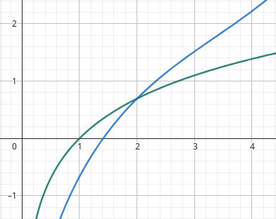

A série de Taylor é um artifício matemático criado para aproximar funções complexas a partir de um somatório finito de polinômios. Veja a fórmula a seguir.

$$
f(x) = \sum_{n=0}^{\infty} \frac{f^{(n)}(a)}{n!}(x - a)^n
$$

Sendo $$ f(x) $$ uma função dada, então podemos aplicar a série de Taylor para aproximar qualquer ponto dessa função.

Tomando por exemplo a função $$ ln(x) $$ podemos fazer uma aproximação para $$ ln(2) $$. Vamos definir $$ n $$ indo de $$ 0 $$ até $$ 3 $$ na série, isso já da uma boa aproximação. Desse modo, derivando $$ f(x) $$ até a ordem 3 teremos:

$$
f'(x) = \frac{1}{x},
f''(x) = -\frac{1}{x^2},
f'''(x) = \frac{2}{x^3}
$$

Como usaremos $$ a = 2$$ as derivadas serão:

$$
f'(2) = \frac{1}{2},
f''(2) = -\frac{1}{4},
f'''(2) = \frac{2}{8}
$$

Sabendo isso já podemos aplicar a série de Taylor para aproximar o valor da função no ponto. Aplicando teremos:

$$
f(x) \approx ln(x) + \frac{(x-2)}{2} - \frac{(x-2)^2}{8} + \frac{(x-2)^3}{24}
$$

Note os gráficos estão representado abaixo. A curva em verde representa $$ ln(x) $$ e a azul representa $$ f(x) $$:

A primeiro momento a curva azul não parece convergir para a curva verde mas isso porque pegamos um $$ n $$ pequeno, conforme $$ n $$ cresce o gráfico se refina e vai se aproximando dos valores da função inicial para $$ x $$ mais distantes de $$ a $$.

Com isso, se aplicarmos $$ f(x) $$ com $$ x $$ próximos o suficiente de $$ 2 $$ conseguimos obter um valor muito próximo do que seria $$ ln(x) $$.

Desse modo, concuí-se que a série de Taylor é uma ferramente importante e muito usada em diversos segmentos para obtermos valores complexos de forma mais simples.
